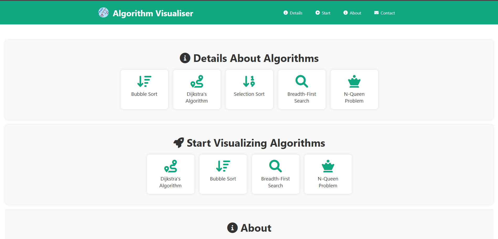
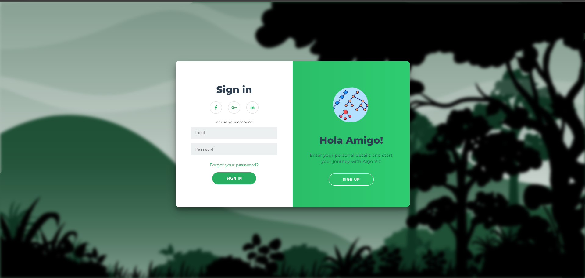
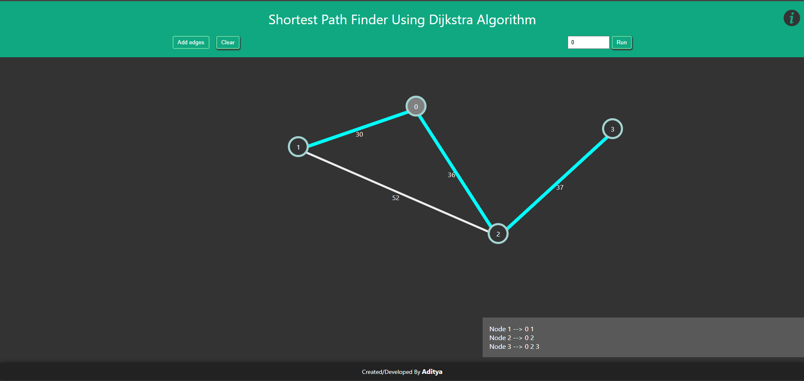
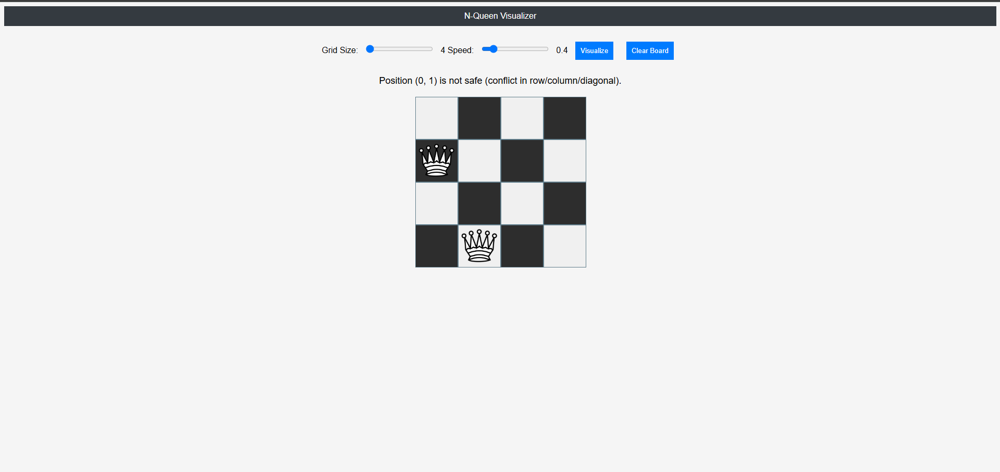
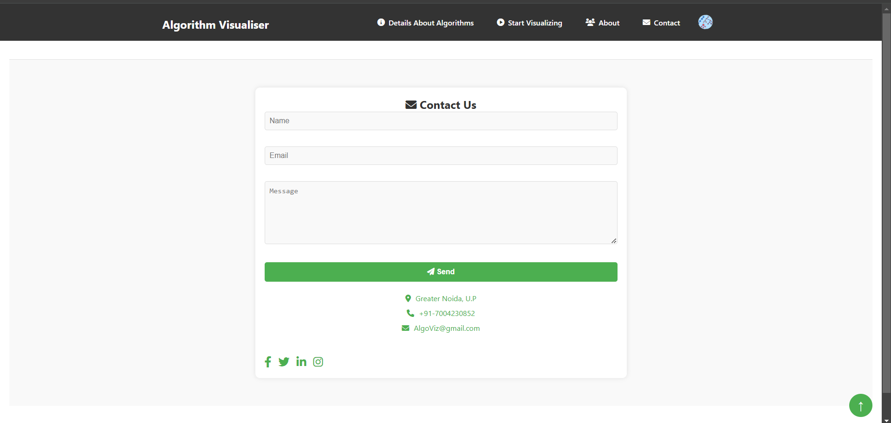

# Algorithm Visualizer

  
<strong>AlgoViz</strong> is a comprehensive, interactive platform to visualize and learn various <strong>data structures</strong> and <strong>algorithms</strong>. It provides a hands-on, engaging experience for understanding core concepts in computer science, such as sorting algorithms, graph algorithms, and more.

---

## 🚀 Features

- **Interactive Visualizations**: Visualize algorithms in action with dynamic animations.
- **Multiple Algorithms**: Explore algorithms like Bubble Sort, Dijkstra's Algorithm, BFS, and more.
- **User-Friendly Interface**: Easy-to-use with a clean, responsive design.
- **Real-Time Updates**: See changes and results in real-time as the algorithms run.
- **Algorithm Information**: Detailed explanations of each algorithm with step-by-step walkthroughs.

---

## 🌐 Technologies Used

- **HTML5, CSS3, JavaScript**: Core technologies for frontend development.
- **GSAP**: Smooth animations for algorithm visualizations.
- **Node.js (Optional)**: For server-side functionalities (if applicable).
- **Git**: Version control to track changes and collaboration.

---

## 🖼️ Screenshots

Here are some examples of how the platform looks:

  
This is where users can navigate through various algorithms and learn more about them.

  
A view of the login page.

  
An interactive visualization of sorting algorithms like Bubble Sort.

  
Visualize graph traversal algorithms like Dijkstra’s Algorithm.

  
The interactive N-Queen problem visualization.

  
The contact page for getting in touch.

---

## 🛠️ How to Run Locally

### Clone the repository
```bash
git clone https://github.com/Aditya-0009/AlgoViz.git
```
---

## 🔄 Future Enhancements

- **User Accounts**: Adding a feature to save user progress.
- **Additional Algorithms**: More algorithms, such as dynamic programming and searching algorithms, can be added.
- **Mobile Support**: Improve the user interface for mobile devices.
- **Dark Mode**: Add a toggle for switching between light and dark themes.

---

## 🙏 Support

If you encounter any issues, feel free to open an Issue in the GitHub repository, and I’ll get back to you as soon as possible.

---

## 👨‍💻 Created By

**Aditya Raj**  
GitHub: [Aditya-0009](https://github.com/Aditya-0009)  
Email: [technoadityaraj@gmail.com](mailto:technoadityaraj@gmail.com)  
LinkedIn: [Aditya Raj](https://www.linkedin.com/in/aditya-raj-007kj/)


